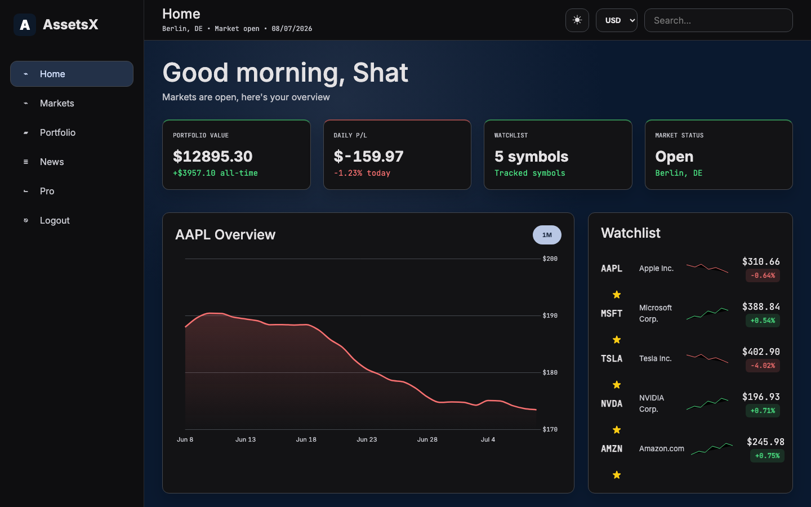
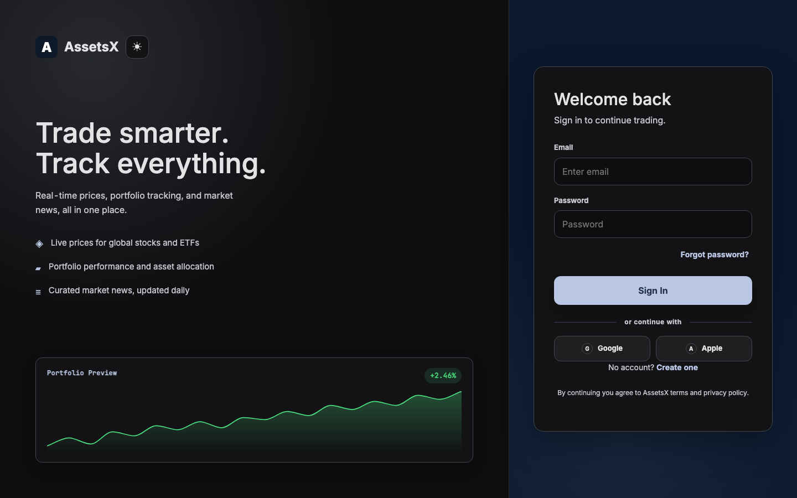
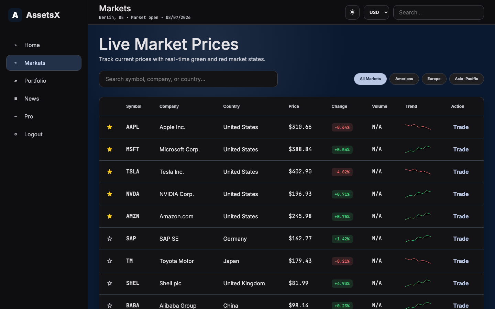
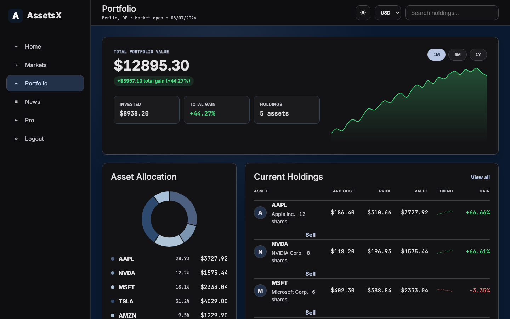
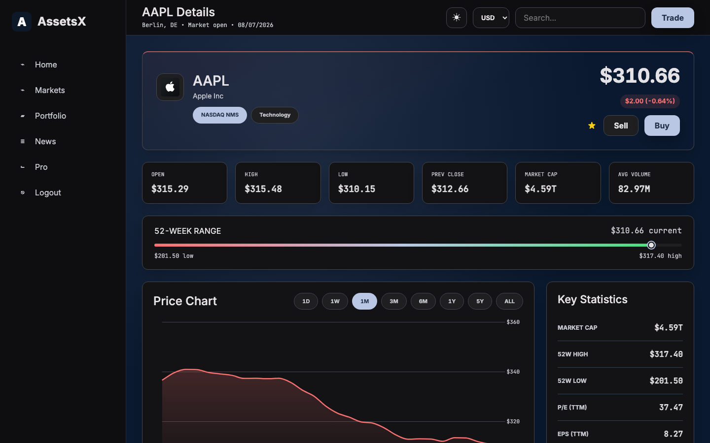
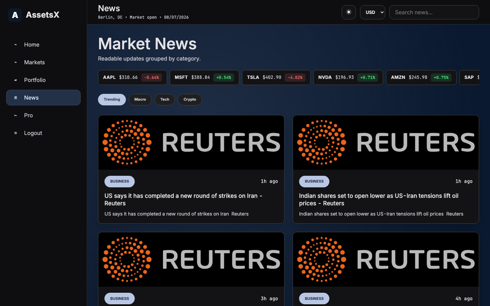
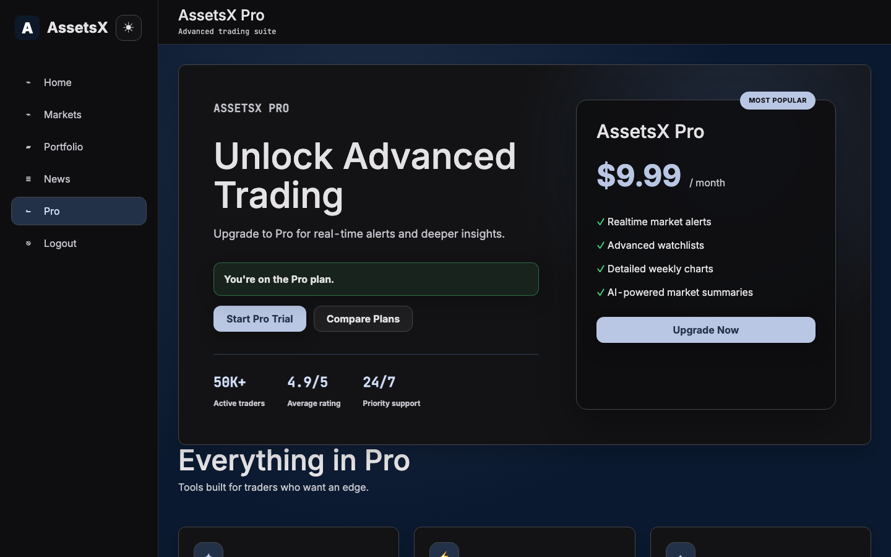

# AssetsX

A stock market tracking platform built as a group project for the Semester 4 **Frontend Designing** module. It covers the full frontend workflow: the UI was designed in Figma first, then built twice, once as a responsive web app and once as a Flutter mobile app, both running on live market data.



## What's in this repo

| Folder | What it is |
|---|---|
| [`web/`](web) | Responsive web app. Vanilla HTML/CSS/JS with PHP auth, Firebase (REST only, no SDK) and live Finnhub market data. |
| [`mobile/`](mobile) | Flutter mobile app for Android and iOS with live prices, charts and GPS based location detection. |
| [`design/`](design) | The original Figma design file (`AssetsX.fig`) the interfaces were built from. |
| [`docs/screenshots/`](docs/screenshots) | Screenshots of the running web app. |

## Tech stack

**Web app**
- HTML5, CSS3 (mobile first, custom dark and light themes)
- Vanilla JavaScript with ES modules, no frameworks
- PHP for server side auth (login, register, sessions)
- Bootstrap 5.3.8 and Chart.js 4.5.1 (both pinned to the latest releases)
- Firebase Authentication and Firestore, called through their REST APIs with plain `fetch()` and PHP cURL, no Firebase SDK anywhere
- Finnhub Stock API for real time quotes, candles and news
- ipapi.co for geolocation shown in the header

**Mobile app**
- Flutter and Dart
- `fl_chart` for price charts
- `http` for Finnhub and OpenStreetMap requests
- `geolocator` for GPS location, `url_launcher` for opening the web app
- `shared_preferences` for the local session

**Design**
- Figma for the complete UI design of both apps

## Screenshots

| Landing | Markets |
|---|---|
|  |  |

| Portfolio | Stock detail |
|---|---|
|  |  |

| News | Pro |
|---|---|
|  |  |

## Running it

Both apps need a free [Finnhub](https://finnhub.io) API key. The keys in this repo are placeholders.

**Web:** put your Finnhub key and Firebase project values in `web/js/config.js` (and the same Firebase values in `web/firebase_helper.php`), then:

```bash
cd web
npm run dev   # serves on http://localhost:5173
```

The web README has the full Firebase setup, including the Firestore security rules.

**Mobile:** replace `YOUR_FINNHUB_API_KEY` in the screen files under `mobile/lib/screens/`, then:

```bash
cd mobile
flutter pub get
flutter run
```

Each folder has its own README with the full feature list and project structure.
